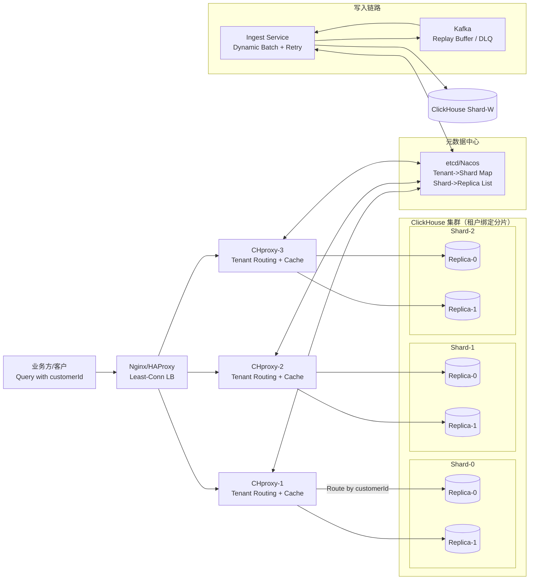
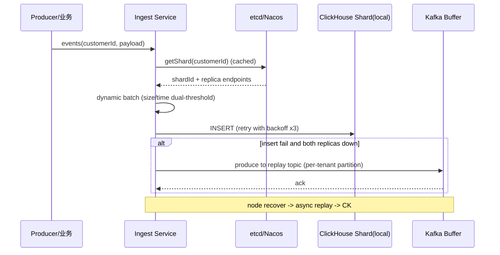
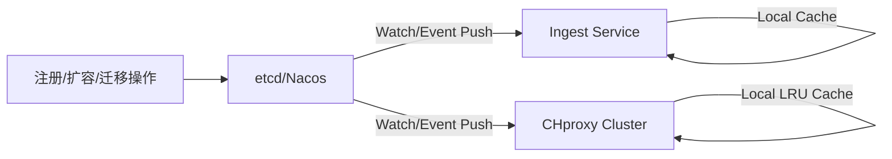

# 多租户高并发特征查询平台：从“MPP全员参赛”到“租户绑定+单分片局部计算”的架构创新方案

> 角色视角：资深大数据架构师
> 目标：在不侵入业务的前提下，突破传统 ClickHouse MPP 在多租户高并发下的资源竞争与跨节点开销，稳定支撑 **2400+ QPS** 且可线性扩展。

---

## 1. 业务背景与关键矛盾（Why Now）

AI 安服业务以“多租户数据特征查询服务”为核心：**租户数持续增长、查询并发高、查询形态碎片化（高频小查询为主）**。
当前痛点本质是：**ClickHouse 传统 MPP 查询模式**会把一次查询扩散到集群多节点参与（分布式表 + 跨节点聚合），导致：

* **跨节点资源竞争**：CPU/IO/内存被非本租户请求挤占，“噪声邻居”显著；
* **网络传输开销**：分布式执行的 shuffle/merge 成为瓶颈；
* **单分片并发能力有限**：100–200 QPS/分片，无法在多租户并发模型下自然扩张；
* **扩容收益不线性**：节点越多，MPP 的协调与数据交换成本越高，收益递减。

结论：要想把并发做上去，必须把**“查询扩散”改为“查询收敛”**，让查询尽可能只落到**一个分片（或其副本）**本地完成。

---

## 2. 方案总览：核心理念与路线

### 核心理念：租户“物理收敛”，查询“本地计算”

* **租户-分片绑定**：单租户全量数据固定写入一个分片（含副本），实现物理隔离；
* **本地表查询优先**：绝大部分查询只需访问本分片本地表，避免分布式执行；
* **代理层智能路由**：业务只传 customerId，路由层完成定位、负载均衡与故障切换；
* **QoS 与隔离**：把资源与并发控制做成平台能力，不让业务背锅；
* **可扩展性**：新增分片 = 新增租户容量与并发能力（线性增长）。

---

## 3. 目标体系（对应你的5大目标逐条落地）

### 3.1 性能突破

* 将查询从 MPP 全节点扩散，改为 **单分片/单副本本地执行**；
* 结合连接池、缓存、智能副本选择，满足 **2400+ QPS**，**P99 < 1s**。

### 3.2 线性扩展

* 新增分片可承接新增租户（或进行租户迁移），实现“容量/并发”近似线性扩张；
* 元数据中心支持扩容/迁移实时生效。

### 3.3 高可用与零丢失

* ClickHouse：分片多副本；路由层：秒级健康探测+自动切换；
* 写入失败：重试 + Kafka 暂存回放，保障 **数据零丢失**。

### 3.4 业务无侵入

* 业务请求只需携带 customerId（Header/Token/QueryParam 均可）；
* “路由/隔离/缓存/限流/故障切换”全部平台化。

### 3.5 资源可控

* ClickHouse Workload 管控（队列/并发/内存/CPU） + 代理层限流；
* 租户等级化：免费/普通/高级/核心，差异化 SLA。

---

## 4. 全链路创新架构（图文结合）

### 4.1 总体架构图（端到端）



**关键解释：**

* 查询：**LB → CHproxy 集群 → 指定分片（优先本地副本）**，不再全员 MPP；
* 写入：**Ingest Service 根据 customerId 直接写入绑定分片**；
* 元数据：分离至 etcd/Nacos，代理与写入端“监听变更 + 本地缓存”。

---

## 5. 分层设计与关键机制（对应你提供的六大优化点，补全工程细节）

### 5.1 硬件层：为高频小查询“打地基”

* 全 SSD：降低随机读延迟，提升吞吐；
* 大内存：提高热点数据缓存命中率；
* 建议补充：

  * NUMA/CPU 亲和与 IO 调度参数基线；
  * 明确 ClickHouse `mark_cache`、`uncompressed_cache`、OS page cache 策略与监控。

---

### 5.2 写入层：租户隔离 + 动态攒批 + 容错兜底（补全落地形态）

#### 写入链路结构图



#### 补全工程要点

* **租户-分片绑定策略**：

  * 初次注册：一致性哈希（带虚拟节点）或“容量权重”分配到分片；
  * 后续：支持“租户迁移”（见 7.2）而非频繁重平衡。
* **动态攒批**：

  * 以租户近 5min 的 EWMA 吞吐估算写入压力；
  * 参数自动调节：`batchSize`、`flushIntervalMs`，并设置上下限防抖；
* **失败兜底**：

  * 主/副本不可用 → Kafka 暂存（按 tenant 分区保证局部有序）；
  * 回放带幂等：写入表可使用 `ReplacingMergeTree`/去重键（业务主键 + ts）或外部幂等 Key；
* **写入限流**：

  * 每租户 Token Bucket；触发时进行降级（丢弃低价值/仅延迟写入/打入缓冲）。

---

### 5.3 查询路由层：CHproxy 增强 + 智能路由 + 性能加速（补全细节与算法）

#### 查询路由内部结构图

```mermaid
flowchart TB
  Q[Incoming Query\ncustomerId + SQL] --> A[Auth & Tenant Parse]
  A --> M[Meta Cache\nLRU + Watcher]
  M --> R[Routing Decision\nShard + Replica]
  R --> P[Policy Engine\nQoS/RateLimit/Priority]
  P --> C[Conn Pool]
  P --> H[Query Cache\nhash(customerId+SQL)]
  H -->|hit| RET[Return Result]
  H -->|miss| C --> CH[(ClickHouse Replica)]
  CH --> RET
  CH --> H
```

#### 智能路由补全（可直接落地）

* **副本选择策略**（建议“多指标打分”而非单一 CPU）：

  * `score = w1*cpu + w2*io_wait + w3*active_queries + w4*mem_pressure`
  * 加入“冷却时间”避免抖动；失败熔断（断路器）防止雪崩；
* **连接池复用**：按 shard/replica 建立池，减少握手与 TLS 成本；
* **查询缓存**：

  * key：`hash(customerId + normalizedSQL + params)`；
  * TTL：1–5min；支持“强制绕过”开关用于排障；
  * 对于强一致敏感查询：按租户/表的写入时间戳进行 cache bust（可选）。

---

### 5.4 元数据管理：独立存储 + 实时同步 + 多级缓存（补全一致性模型）

#### 元数据与变更传播图



**一致性保证：**

* 强一致不必追求“瞬时一致”，但必须“可证明可收敛”：

  * 变更事件带版本号/时间戳；
  * Proxy/Ingest 只接受更高版本覆盖；
  * 发生短暂不一致时，查询可通过“重定向/重试一次”收敛。

---

### 5.5 资源隔离与 QoS：从“限制”到“分级经营”

* **ClickHouse 层**：使用资源队列/并发/内存限制（你给的参数很合理，可按等级模板化）
* **代理层**：Token Bucket 限流 + 排队（核心租户可排队，普通租户直接拒绝）
* **优先级调度**：

  * 代理在 Header 注入优先级；
  * ClickHouse 侧配合不同 workload profile / priority。

> 创新点强化：把 QoS 做成“产品能力”——可配置、可观测、可审计（谁被限流、为何被限流、影响多大）。

---

### 5.6 高可用：全链路多副本 + 自动切换（补全故障域与演练）

* 分片副本跨机架/可用区：避免同故障域；
* CHproxy：无状态水平扩展；LB 负责流量分担；
* 健康检查：不仅探活 TCP，还要做轻量 SQL（如 `SELECT 1` 或 `system.metrics`）；
* 故障切换策略：

  * 主副本失败 → 切到副本；
  * 副本也异常 → 返回可解释错误 + 熔断（避免重试风暴）；
* 建议补充：

  * 定期故障演练（杀进程/断网/磁盘满）；
  * RTO/RPO 指标写入 SLO 文档。

---

## 6. 核心创新亮点（提升“创新文档”的表达力度）

### 6.1 架构创新：租户“绑定分片”，从根源绕开 MPP 高并发瓶颈

把“查询任务”从全局分布式变为局部单分片：
**“网络交换”→“本地计算”**，QPS 天花板从 MPP 协调瓶颈转移为“分片可扩展的算力瓶颈”。

### 6.2 技术创新：动态攒批 + 元数据实时同步 + 智能副本路由，兼顾吞吐与体验

* 写入端自适应：不同租户写入节奏不同，系统自动调参；
* 代理端自适应：副本选择随负载动态变化，保证稳定 P99。

### 6.3 工程创新：CHproxy 深度定制，业务无侵入“平台化交付”

* 业务只认 customerId，不认 shard；
* 平台替业务解决：路由、缓存、连接池、限流、熔断、切换。

### 6.4 管控创新：QoS 体系让平台“可经营”

不仅跑得快，还要跑得稳、跑得可控：
核心租户 SLA 可保障，普通租户可限流，故障不扩散。

---

## 7. 关键补充：工程落地必须考虑的两件“大事”（让方案更完整更专业）

### 7.1 租户迁移能力（避免绑定后“永远不能动”）

当某个分片租户过多/热点租户过热，需要支持迁移：

* 双写（旧分片+新分片）→ 校验 → 切读 → 停旧写；
* 元数据中心版本化变更，代理按版本切路由；
* 迁移期间缓存自动失效，避免读到旧数据。

### 7.2 观测与治理闭环（否则 2400 QPS 只能靠运气）

必须有指标体系：

* 代理：QPS、P50/P95/P99、cache hit、限流数、路由失败数、熔断状态；
* ClickHouse：每分片 active queries、IO wait、merges、CPU、内存、慢查询；
* Kafka：积压、回放速率、失败重试。

---

## 8. 预期实施效果与业务价值（与你给的结论对齐并更“可交付”）

### 8.1 实施效果（可量化）

* 并发能力：**10 倍+** 提升，稳定支撑 **2400+ QPS**；
* 延迟：P99 控制在 **1s** 内（高频小查询场景）；
* 可用性：全链路多副本 + 自动切换，目标 **99.99%**；
* 数据安全：写入失败 Kafka 暂存回放，**零丢失**。

### 8.2 业务价值（可向上汇报）

* **解锁增长**：性能瓶颈不再制约客户规模；
* **成本更可控**：资源隔离 + 线性扩容，避免无脑堆机器；
* **竞争力提升**：高并发低延迟体验提升客户满意度与续费率；
* **平台化交付**：接入成本低，业务研发效率提升。

---

## 9. 总结：一句话打透创新点

> 用“租户-分片绑定”把查询从 MPP 全局扩散变成单分片本地计算，再用“智能路由+动态攒批+元数据实时同步+QoS”把性能、稳定性、可控性做成平台能力，从而实现 **并发线性扩展** 与 **业务无侵入** 的多租户高并发查询服务。

如果你希望我把这篇创新文档改成更贴近评审/立项格式（如：现状数据→瓶颈定位→对比方案→成本收益测算→风险与演练计划→里程碑排期），我也可以直接给出可用于汇报的版本。
