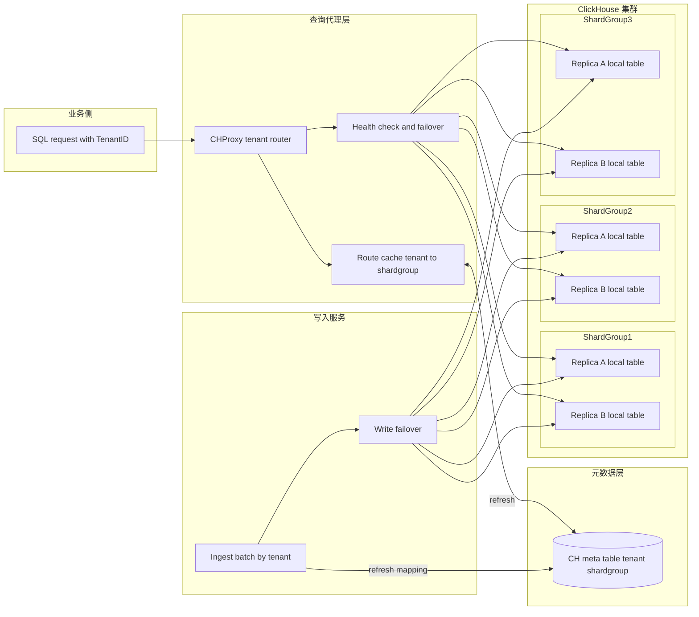
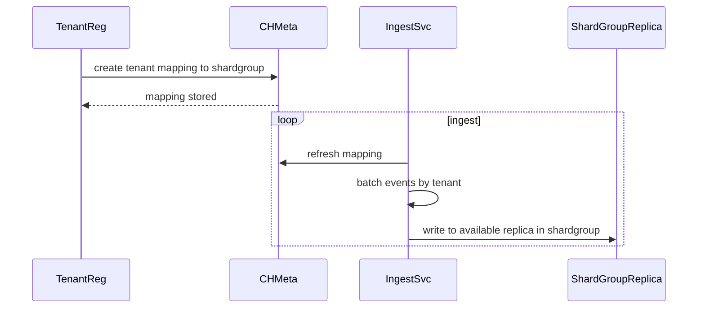
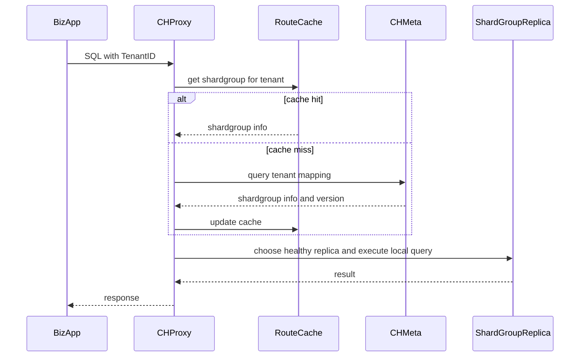

## 1. 背景与问题本质（高并发 + MPP 广播导致系统性放大）

在 AI 安服业务中，客户多且查询相互独立，总体并发约 **2400**。ClickHouse 默认的分布式查询（Distributed 表 / MPP 执行）会把**一次查询广播到多个分片/节点并行执行**。当并发上来后会出现典型问题：

* **Fan-out 放大**：1 次查询变成 N 个节点的子查询与汇聚，调度与网络开销被并发乘法放大
* **资源竞争**：不同租户的小查询互相抢线程池/CPU/IO，P99 延迟迅速恶化
* **可用性敏感**：慢节点/抖动节点会放大尾延迟，影响全局

因此瓶颈不在 ClickHouse 单机性能，而在 **“多租户高并发”与“MPP 广播执行”** 的组合机制。

---

## 2. 创新总览：租户本地化 + 透明代理路由 + 副本自动容灾（从“广播”变“定点”）

目标：消除“一次查询全节点执行”的系统性放大，并在分片故障时利用 ClickHouse 副本机制实现**自动切换**。

### 核心设计

1. **数据放置（写入侧）**：租户注册时绑定一个**分片组（Shard Group）**（而非绑定单一机器），该分片组由 **主副本（replicas）**组成。写入按租户攒批，确保一个租户的数据逻辑上落在同一分片组内的本地表（Replicated 表）。

2. **查询路由（查询侧）**：业务只需在请求头携带 `TenantID`。改造后的 CHProxy 读取“租户 → 分片组”的映射，并路由到该分片组内**健康副本**执行本地查询，业务无感知节点拓扑与切换。

3. **副本容灾（可用性）**：当一个分片组内某个节点故障，CHProxy 会自动选择该分片组内其他健康副本；写入服务同理，写入自动切换到可用副本。

> 这与 ClickHouse 的副本机制（Replicated 系列表引擎）天然契合：副本间数据一致，由写入/查询客户端选择可用副本即可完成无感容灾。

---

## 3. 端到端架构（保证可渲染：不使用换行符、复杂括号与特殊字符）

### 3.1 总体架构图（写入 + 查询 + 元数据 + 副本容灾）

**读图说明**

* 业务请求只打到 CHProxy，带 `TenantID` 即可
* CHProxy 根据映射找到租户所属 ShardGroup，并在该组内做健康探测与故障切换
* 写入服务同样按映射写入 ShardGroup，并在副本间自动切换

---

## 4. 写入侧方案（租户绑定 ShardGroup + 攒批写入 + 副本自动切换）

### 4.1 写入路径时序图（可渲染）

### 4.2 写入关键点（工程可落地）

* **租户注册绑定 ShardGroup**：把租户与“分片组”绑定，而不是绑定到单点节点，天然支持副本容灾
* **Tenant 攒批**：buffer 按 tenant 聚合，按 size 或 interval flush，降低小包写放大
* **幂等与一致性**：建议按事件 id 或业务主键做幂等写入策略（如 ReplacingMergeTree 或业务层幂等）
* **写入故障切换**：写入端维护 shardgroup 的 replica 列表与健康状态，失败重试切换至同组可用副本

---

## 5. 查询侧方案（CHProxy 源码改造：TenantID 路由 + 组内副本容灾）

### 5.1 查询路径时序图（可渲染）

### 5.2 CHProxy 改造要点（建议写进创新点）

* **Header 解析**：读取 `TenantID`，作为路由主键
* **路由缓存**：tenant -> shardgroup 映射缓存，支持 version 增量刷新
* **组内副本选择**：优先同 AZ 或低延迟副本；失败自动切换
* **隔离与限流**：按 tenant 维度限流与熔断，避免单租户打爆某个 shardgroup

---

## 6. 元数据设计（租户到分片组映射，支持动态扩容与迁移）

### 6.1 元数据模型建议

建议一张映射表（概念字段）：

* tenant_id
* shard_group_id
* replicas_endpoints（或通过 shard_group_id 再查副本表）
* status（active migrating disabled）
* version
* updated_at

### 6.2 刷新机制（避免全量刷新成本）

* CHProxy 与写入服务均保存 `last_version`
* 通过 `version` 做增量更新，必要时周期性全量兜底
* 租户新增或变更可触发快速刷新（可选推送，但非必须）

---

## 7. 扩容与运营能力（真正的“平台化价值”）

### 7.1 水平扩容为什么近似线性

* 新增 ShardGroup 直接承接新租户
* 查询从“全局广播”变为“定点到租户分片组”，并发能力基本随 ShardGroup 数增加而增长
* 路由层无状态水平扩展，缓存与元数据增量刷新成本可控

### 7.2 热点租户治理与重平衡

* 热点租户可以单独放入高配 ShardGroup
* 支持租户迁移：将 mapping 切到新 ShardGroup，并通过双写或回放方式保证一致性（迁移窗口低峰进行）

---

## 8. 效果与收益（结合副本机制后的更完整结论）

* **彻底避免 MPP 广播执行**：一次查询只落到租户所属 ShardGroup 的本地表执行
* **高并发能力显著提升**：减少 fan-out 与跨节点竞争，整体吞吐提升可达 **10 倍以上**，满足约 2400 并发的业务诉求
* **可用性更强**：利用 ClickHouse 副本机制，ShardGroup 内副本故障时，写入与查询均可自动切换到可用副本
* **平台化与可运营**：业务只需提供 TenantID；扩容、迁移、隔离、容灾均由平台层统一治理

1. ClickHouse 表引擎与副本建议（ReplicatedMergeTree 系列、分区与排序键、TTL）
2. 租户迁移的标准流程图（active 到 migrating 到 cutover），以及查询一致性策略（读旧写新或双写读新校验）
